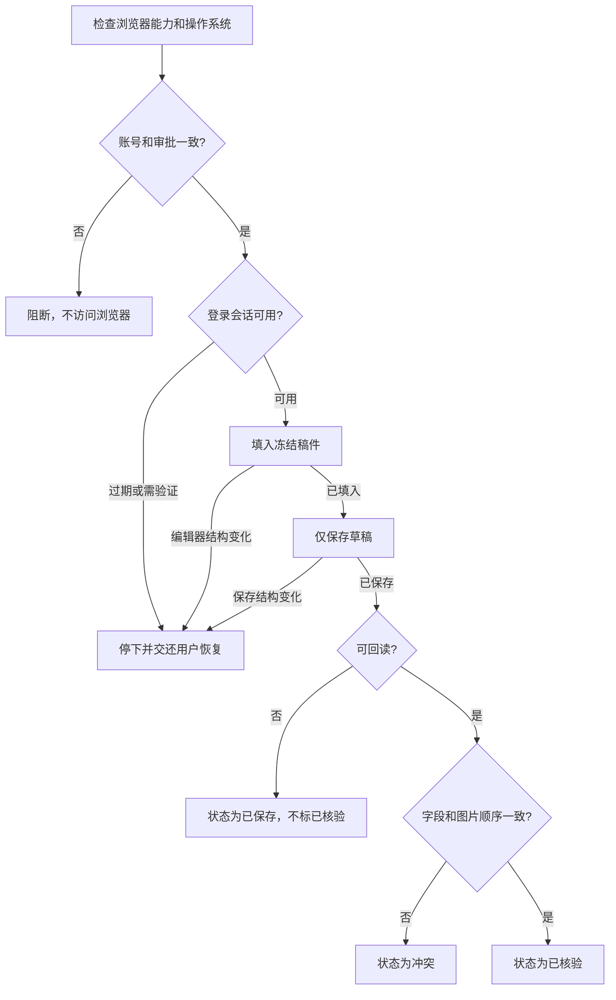

# 内容平台受控浏览器草稿路径

该路径用于 API 草稿能力不可用、且用户明确选择使用当前浏览器会话保存草稿时。它只执行“保存草稿”，不提供发布或群发动作。

## 使用前提

浏览器能力与操作系统支持是两个独立门禁：

- 浏览器能力必须明确为 `available`，不能用 `unknown` 代替可用。
- 操作系统必须明确为 `supported`，浏览器可用不代表当前系统已验证。
- 目标账号必须与冻结交付包、审批记录及用户本次明确选择的账号一致。
- 正文、摘要、标题、图片顺序或目标账号在审批后发生变化时，必须重新审批。
- 登录会话由用户授权；插件不读取、记录或转移登录凭据。

## 受控步骤

系统分别记录三类证据：

1. `filled`：编辑器已填入冻结内容。
2. `saved`：内容平台返回草稿标识并确认保存动作完成。
3. `verified`：重新读取草稿后，标题、摘要、正文和图片顺序与冻结交付包一致。

缺少回读时最多只能报告 `saved`。登录过期、出现验证挑战或编辑器结构变化时，流程返回可恢复状态并停止；恢复后仍使用用户明确选择的同一账号，不会静默切换账号、浏览器或权限模式。

## 当前验证边界

本仓库自动化测试覆盖状态机、账号与审批绑定、编辑器结构变化和回读冲突。真实内容平台登录、保存和回读需要用户授权会话；未执行真实验证时，相关证据必须保持 `NOT_RUN`，不能用模拟结果替代。
