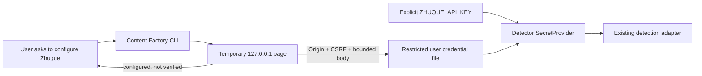

# Local Zhuque setup design

## Flow

The CLI owns the temporary HTTP listener. The browser loads only packaged HTML/CSS/JavaScript. No article content or API key is sent to a remote service by setup or status checks.

## Credential contract

- Resolve only the detector's `AI_CONTENT_DETECTOR_PRIMARY` reference.
- Lookup order is explicit process `ZHUQUE_API_KEY`, then current-user configuration.
- On Unix, use `$XDG_CONFIG_HOME/content-factory/credentials.json` or `~/.config/content-factory/credentials.json`; on Windows, use `%APPDATA%/content-factory/credentials.json`.
- Create the credential directory with owner-only access and atomically replace the credential file with mode `0600` on Unix. Reject symlink targets and do not print or return the value.
- Saving a new key rotates the local value; an environment override continues to win until removed from that process.

## Local page security

Bind only `127.0.0.1` on an ephemeral port. For POST, require an exact local Origin and Host, a random CSRF token, JSON Content-Type, and a bounded request body. Return generic errors and never reflect the key. Set `no-store`, restrictive CSP, `nosniff`, and `no-referrer` headers. The page clears the password field after submission; the listener shuts down after ten minutes or interruption.

## Evidence boundary

The UI can say `not configured` or `saved locally (not API-verified)`. It cannot say `valid`, `connected`, or `detection passed` without an authenticated provider response bound to the exact submitted text revision. API transport and live acceptance remain in CF-025/CF-030.
